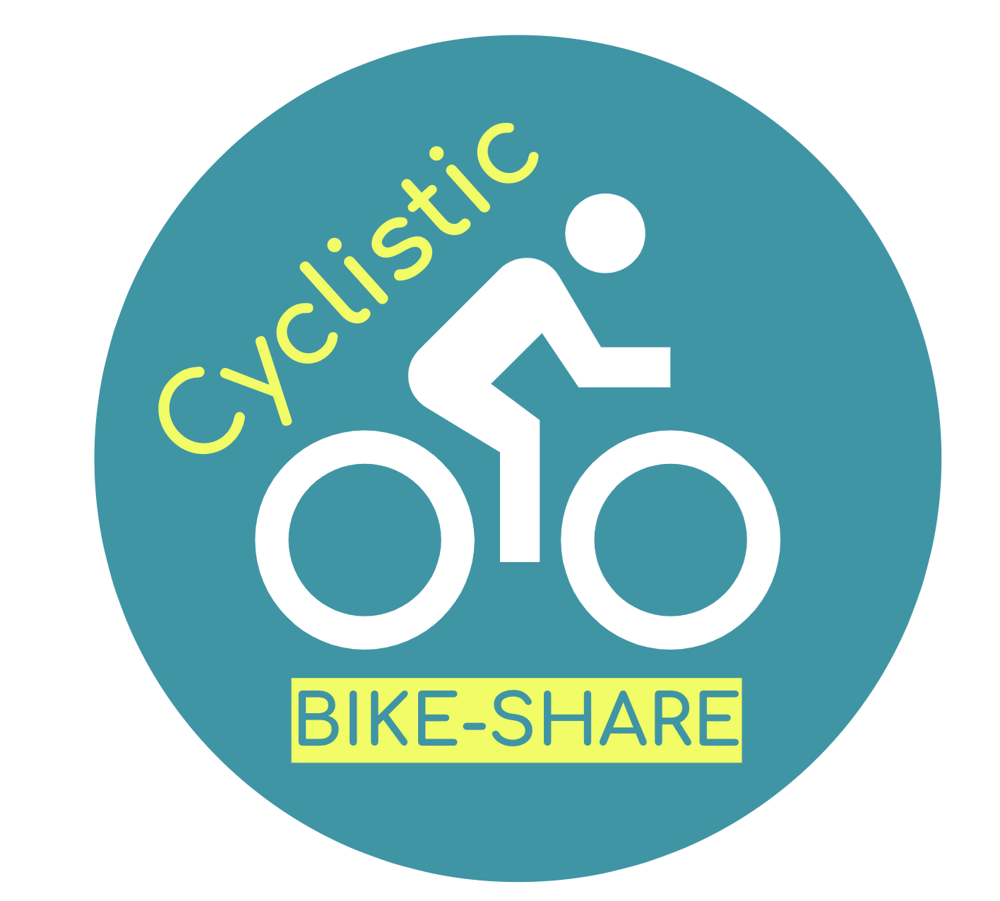

# Cyclistic-Capstone-Project

## Backgroud

<p align="center">
  
</p>

### About Cyclistic:
In 2016, Cyclistic launched a successful bike-share offering across Chicago. The bikes can be unlocked from one station and returned to any other station anytime.

Until now, Cyclistic’s marketing strategy relied on building general awareness and appealing to broad consumer segments. One approach that helped make these things possible was the flexibility of its pricing plans: single-ride passes, full-day passes, and annual memberships. Customers who purchase single-ride or full-day passes are referred to as casual riders. Customers who purchase annual memberships are Cyclistic members. 

Cyclistic’s finance analysts have concluded that annual members are much more profitable than casual riders. The director of marketing, Lily Moreno, believes that maximizing the number of annual members will be key to future growth. Rather than creating a marketing campaign that targets all-new customers, Moreno believes there is a solid opportunity to convert casual riders into members. 

Moreno has set a clear goal: Design marketing strategies aimed at converting casual riders into annual members. In order to do that, however, the team needs to better understand how annual members and casual riders differ, why casual riders would buy a membership, and how digital media could affect their marketing tactics. 

As a junior data analyst working on the marketing analyst team at Cyclistic, under the direction of Moreno, my role is to analyze Cyclistic historic bike trip data to spot trends and make insight about how casual riders and annual members use Cyclistic bikes differently. From these insights, my team will design a new marketing strategy to convert casual riders into annual members. 


## Ask Phase

Three questions will guide the future marketing program:
1. How do annual members and casual riders use Cyclistic bikes differently?
2. Why would casual riders buy Cyclistic annual memberships?
3. How can Cyclistic use digital media to influence casual riders to become members?

Moreno has assigned me the first question to answer: How do annual members and casual riders use Cyclistic bikes differently?

### Key Components

- **Business Task**: Analyze the differences in bike usage between casual riders and annual members to design a marketing strategy that converts casual riders into annual members. 
      
- **Problem Statement**:
Identify trends in bike usage patterns between annual and casual members to provide actionable insights for the marketing team.
      
- **Impact on Business Decisions**:
My insights will assist the marketing team to designing targeted campaigns to increase annual memberships by conveting casual riders.
      
- **Stakeholders**:

    * Cyclistic Management: This includes the director of marketing, Lily Moreno, and other executives who are interested in increasing profitability and growth.
    * Marketing Team: Analysts and strategists that design and implement the marketing strategies based on the data analysis.
    * Data Analysts: My team, responsible for identifying trends and insights.
    * Casual Riders: Users who purchase single-ride or full-day passes, whose behaviors and preferences need to be understood to convert them into annual members.
    * Annual Members: Current subscribers whose behaviors serve as a reference for strategies to atract casual riders.


## Prepare phase:

- **Data Used**: The last 12 months (June 2023 to June 2024) of Cyclistic’s historical trip data will be analized to indentify trends.
	
- **Data Location**: The data is stored in a public repository provided by Motivate International Inc., where monthly datasets are uploaded as new data becomes available. 

- **Data License**: The data is available to the public. Bikeshare grants a non-exclusive, royalty-free, limited, perpetual license to access, reproduce, analyze, copy, modify, distribute and use the Data for any lawful purpose. 

- **Data Organization**: The data is organized in CSV files containing the rides for a one-month period. Each entry includes the start and end times, the start and end stations, the locations of the stations, the type of bike and the type of member for each ride.

- **Credibility and Bias**: The data is provided by Cyclistic itself, which means that it is reliable and comprehensive, capturing all necessary trip details. Its regular updates ensure relevance and the inclusion of all riders supports unbiased analysis.

- **Relevance to Business Questions**: The data provides insights into the differences in bike usage patterns between casual riders and annual members, helpung to identify key behaviors for marketing strategies.

- **Data Limitations**: The data does not include personal information that can identify a user, ensuring privacy but restricting insights into user-specific patterns.

- **Selected Tools**: To clean the data, I decided to use SQL Server for its ability to handle large datasets efficiently. To visualize the data, I chose Tableau Public for its capability to create interactive and visually engaging dashboards.

- **Importing the Data**: First, I created a database called “CyclisticBikeshare” in SQL server and imported each csv file into its own table using SQL Server import and export wizard. Then, I combined the tables from the different files into a single table called “rides_data”.


## Process Phase

After importing the data, I performed the following data cleaning steps:

1. Checked for Duplicates: Verified that there were no duplicated rows in the dataset.

```sql
WITH CTE_row_count AS (
	SELECT *, ROW_NUMBER() OVER (PARTITION BY ride_id, rideable_type, started_at, ended_at, 
		start_station_name, start_station_id, end_station_name, end_station_id, start_lat, 
		start_lng, end_lat, end_lng, member_casual ORDER BY ride_id) AS row_count
	FROM dbo.rides_data)
SELECT COUNT(*)
FROM CTE_row_count
WHERE row_count > 1;
````

2. Validated Column Values:

    - Ensured all values in the member_casual column are valid: either "member" or "casual".
      
    ```sql
    SELECT DISTINCT(member_casual)
    FROM dbo.rides_data;
    ```

    - Ensured all values in the rideable_type column are valid: "electric_bike", "classic_bike", or "docked_bike".

    ```sql
    SELECT DISTINCT(rideable_type)
    FROM dbo.rides_data;
    ```

3. Checked for Missing Values: Verified if there were any NULL values in the started_at and ended_at columns.
   
```sql
SELECT COUNT(ride_id)
FROM dbo.rides_data
WHERE ended_at IS NULL;

SELECT COUNT(ride_id)
FROM dbo.rides_data
WHERE started_at IS NULL;
```

4. Calculated Ride Duration:
    
    - Created a new column, ride_length, to store the ride duration.
      
    ```sql
    ALTER TABLE dbo.rides_data
    ADD ride_length INT;
    ```

    - Computed the duration by subtracting the started_at timestamp from the ended_at timestamp.
      
    ```sql
    UPDATE dbo.rides_data
    SET ride_length = DATEDIFF(SECOND, started_at, ended_at);
    ```

5. Filtered Outliers:
   
    - Removed rides with negative durations.
      
   ```sql
   DELETE FROM dbo.rides_data
   WHERE ride_length < 0;
    ```

    - Removed rides lasting longer than a day.
      
    ```sql
    DELETE FROM dbo.rides_data
    WHERE ride_length > 86400; -- A day has 86400 seconds
    ```
    
    - Removed rides shorter than 30 seconds, as most of these started and ended at the same station, indicating likely user cancellation.
    
    ```sql
    DELETE FROM dbo.rides_data
    WHERE ride_length < 30;
    ```

6. Added Time-Based Columns:
   
    - Added the following columns to analyze user behavior over time:
      
        * week_day (day of the week)
          
        ```sql
        ALTER TABLE dbo.rides_data
        ADD week_day NVARCHAR(50);
        
        UPDATE dbo.rides_data
        SET week_day = DATENAME(dw, started_at);
        ```
        
        * month_week (week of the month)
    
        ```sql
        ALTER TABLE dbo.rides_data
        ADD month_day INT;
        
        UPDATE dbo.rides_data
        SET month_day = DATEPART(dd, started_at);
        ```

        * month (month of the year)
    
        ```sql
        ALTER TABLE dbo.rides_data
        ADD month NVARCHAR(50);
        
        UPDATE dbo.rides_data
        SET month = DATENAME(mm, started_at);
        ```

7. Dropped Irrelevant Columns:
    - Dropped start_station and end_station due to many NULL values and their irrelevance to the analysis.
      
    ```sql
    ALTER TABLE dbo.rides_data
    DROP COLUMN start_station_name, start_station_id, end_station_name, end_station_id;
    ```
	
    - Dropped latitude and longitude columns, as ride duration was determined to be a better indicator of bike usage.

    ```sql
    ALTER TABLE dbo.rides_data
    DROP COLUMN start_lat, start_lng, end_lat, end_lng;
    ```


## Analyze Phase

After the cleaning process, the data is ready to analize. I use SQL Server for the analize phase.

The steps I performed in my analysis were the following:

1. Checked the total number of rides
    ```sql
    SELECT COUNT(*)
    FROM dbo.rides_data;
    ```
    - Result: The total number of rides, after cleaning, is 5 649 726

2.  Counted the number of rides by members and casual users.
    ```sql
    SELECT member_casual AS user_status, COUNT(ride_id) AS user_count
    FROM dbo.rides_data
    GROUP BY member_casual;
    ```
    - Result: The dataset contains 3 638 600 members and 2 011 126 casual users
      
3. Calculated the average ride length in minutes.
    ```sql
    SELECT CONCAT(AVG(CAST(ride_length AS BIGINT)) / 60.0, ' min') AS avg_ride_length -- I cast ride_lenght to BIGINT to avoid arithmetic overflow
    FROM dbo.rides_data;
    ```
    - Result: The average ride length is approximately 15.63 minutes
      
4. Found the length of the longest ride in minutes.
    ```sql
    SELECT MAX(ride_length) / 60.0 AS longest_length
    FROM dbo.rides_data;
    ```
    - Result: The longest ride lasted approximately 1 439.92 minutes
      
5. Identified the days of the week with the highest and lowest bike rentals.
    ```sql
    SELECT week_day, COUNT(*) AS bike_rents
    FROM dbo.rides_data
    GROUP BY week_day
    ORDER BY bike_rents DESC;
    ```
    - Result: Saturday had the most bike rentals with 894 901 bike rides, follewed by Thursday with 844 573 bike rides. Sunday had the lest bike rentals with only 728 595, Monday was the second day with lest bike rental with 738 103.
      
6. Found the month with the most and less bike rentals.
    ```sql
    SELECT month, COUNT(*) AS bike_rents
    FROM dbo.rides_data
    GROUP BY month
    ORDER BY bike_rents DESC;
    ```
    - Result: August had the highest number of rentals: 759 155, followed by July with: 754 123. On the other hand, the month with the lowest number of rental was January with 141 944 and February with 220 317.
      
7. Calculated the average ride length for members and casual users separately.
    ```sql
    SELECT member_casual, CONCAT(AVG(CAST(ride_length AS BIGINT)) / 60.0, ' min') AS avg_ride_length
    FROM dbo.rides_data
    GROUP BY member_casual;
    ```
    - Result: Casual users have an average ride length of approximately 21.42 minutes and member users have an average ride length of approximately 12.44 minutes

8. Calculated the average ride length (in minutes) for casual and member users for each day of the week. 
    ```sql
    WITH RideLength (user_type, week_day, ride_length) AS (
	SELECT member_casual, week_day, CAST(ride_length AS BIGINT) / 60.0
	FROM dbo.rides_data
    )
    SELECT *
    FROM RideLength
    PIVOT(AVG(ride_length) FOR week_day IN([Monday], [Tuesday], [Wednesday], [Thursday], [Friday], [Saturday], [Sunday])) p;
    ```
    - Result: Casual users tend to rent the bikes for more time.


## Share Phase

Now it’s time to create a dashboard to present the findings.

The goal of this analysis is to explore the differences in how casual riders and annual members use Cyclistic bikes. By identifying trends in bike usage patterns (such as rideable type preferences, time-based activity, and ride lengths) it aims to provide actionable insights for the marketing team. These findings will inform strategy to encourage casual riders to convert into annual members. 

<br>


**Rides by User Type and Rideable Type**:

  - Casual riders and members prefer different types of bikes.
    - Casual riders use electric bikes (1.04M rides) slightly more than classic bikes (0.93M rides), with docked bikes being used very minimally (0.05M rides).
    - Members show a preference for classic bikes (1.87M rides) over electric bikes (1.77M rides).

**Total Rides by User Type**:

  - Members account for 3.64M rides, significantly more than casual riders at 2.01M rides. Members are clearly the most frequent users.
    
**Average Ride Length**:

  - Casual riders have a much longer average ride length (21.42 minutes) compared to members (12.45 minutes). This may indicate that casual riders use bikes for leisure or exploratory rides, whereas members may use bikes for routine or shorter commutes.

<br>


**Usage by Time**:

  - Monthly Trends:
    * Casual riders’ activity peaks in the summer months (June to August) and declines sharply in winter, suggesting seasonal usage patterns likely tied to leisure activities.
    * Members maintain more consistent usage throughout the year, with slight dips during the winter months.
  - Weekly Trends:
    * Casual riders are most active on weekends, whereas members use bikes primarily during weekdays, reflecting differences in purpose (leisure vs. commuting).
  - Hourly Trends:
    * Casual riders’ usage peaks in the afternoons, while members have two clear peaks: morning and evening, coinciding with typical commuting hours.
  - Ride Length Trends:
    * Casual riders consistently have longer average ride times than members, regardless of the time of day, week, or month. Ride lengths for casual riders also increase significantly on weekends.


## Recommendations

Based on the analysis, here are some recommendations for Cyclistic's marketing strategy:

1. **Targeted Campaigns**: Design marketing campaigns that specifically target casual riders, emphasizing the benefits of becoming an annual member. Highlight cost savings, flexibility, and convenience.

2. **Seasonal Promotions**: Introduce seasonal promotions during peak usage months (June to August) to encourage casual riders to switch to annual memberships. Offer discounts or special deals for signing up during these months.

3. **Weekend Specials**: Given that casual riders are more active on weekends, consider offering weekend-only promotions or activities that can convert casual riders into members.

4. **Leisure and Commuting Benefits**: Highlight the dual benefits of Cyclistic bikes for both leisure and commuting. Create content that shows how members can enjoy the bikes for both purposes.

5. **User Experience Improvements**: Based on ride length and preferences for bike types, consider improving user experience by ensuring availability and maintenance of electric bikes and classic bikes, as these are preferred by casual riders and members respectively.

6. **Improved Docking Stations and Bikes**: Enhance the docking stations and bikes to encourage usage. Since docked bikes are predominantly used by casual users, improving their availability and condition can help convert casual riders into annual members. Ensure docking stations are conveniently located, well-maintained, and equipped with reliable bikes. 

Implementing these recommendations can help Cyclistic convert more casual riders into annual members, increasing profitability and customer loyalty.
